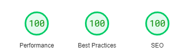

# Personal website
Located at [vtvc.nl](https://vtvc.nl), this website is partially a visiting card, but moreover a technical experiment on how to balance speed and freshness of data. 

## Data sources
It fetches data from API's such as Spotify, Last.fm, as well as a local home assistant instance. By utilising caching techniques such as SWR and ISR we can create a site that loads (near) realtime data, while also achieving top marks in speed.

## One hunnid
We go for nothing less than one hunnid.

